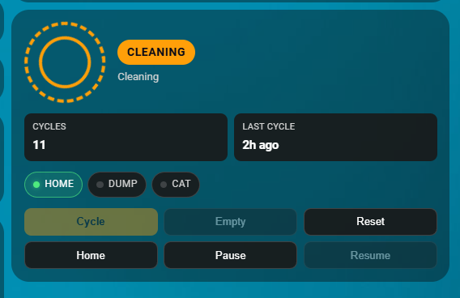
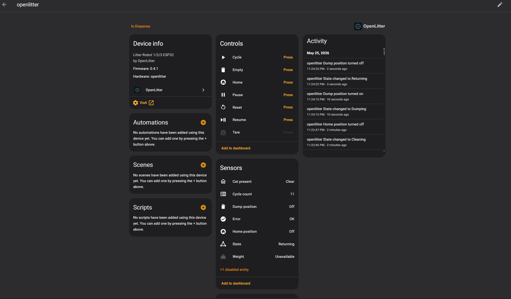
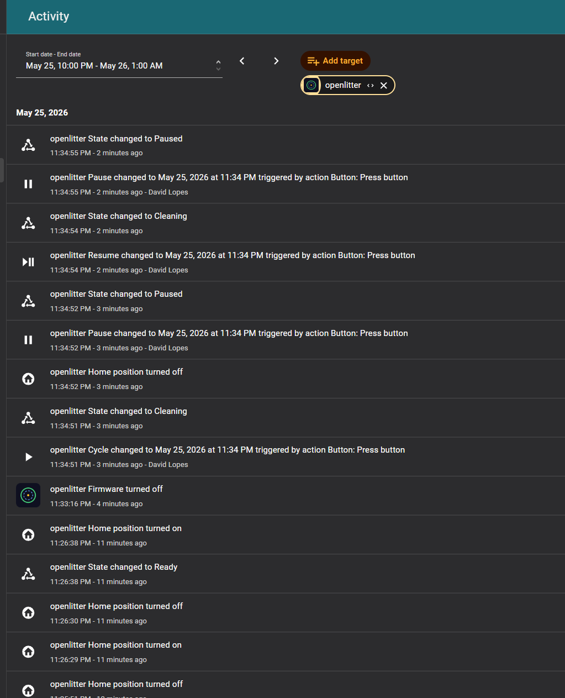
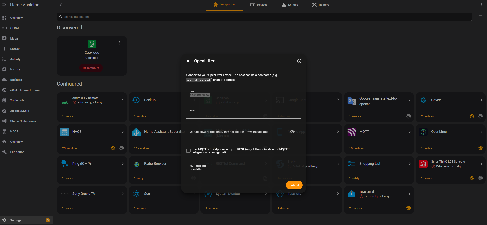
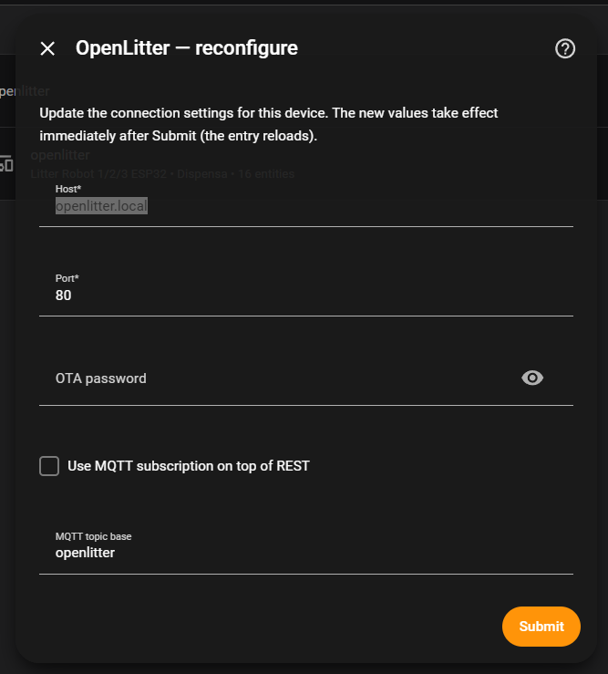
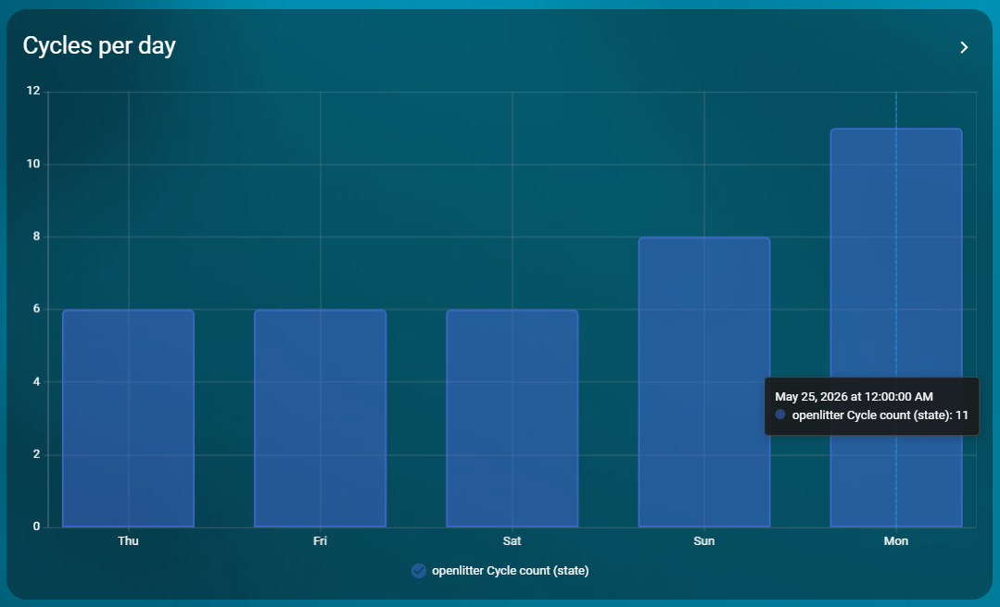

<!--
OpenLitter-HA - Home Assistant integration + Lovelace card for OpenLitter
Copyright (C) 2024 David Lopes (https://github.com/davdlic)
Licensed under the GNU General Public License v3.0 - see LICENSE
-->

# OpenLitter — Home Assistant integration

[](https://github.com/davdlic/OpenLitter-HA/actions/workflows/validate.yml)
[](https://www.gnu.org/licenses/gpl-3.0)
[](https://github.com/hacs/integration)
[](https://www.home-assistant.io/)

Custom integration and Lovelace card for [OpenLitter](https://github.com/davdlic/OpenLitter), the open source ESP32 firmware that replaces the original board of a Litter Robot 1 / 2 / 3.

> [!NOTE]
> Stable from **v1.0.0** onwards — entity ids, MQTT topics, bus event names and the Lovelace card's options are now considered public contract. Tracks firmware releases on [davdlic/OpenLitter](https://github.com/davdlic/OpenLitter); see [Compatibility](#compatibility) for the matrix.

---

## What you get

- **Local push, no broker needed** — talks REST + WebSocket to the device directly. Status updates land in HA within ~500 ms. If you also tick **Use MQTT** in the config flow, the integration subscribes to the firmware's MQTT topics on top, so HA gets updates over whichever transport is freshest.
- **Auto-discovery via mDNS** — HA finds `openlitter.local` on your LAN without you typing an IP. Just accept the discovery toast.
- **Rich entities** — state with a friendly label and the full history array as an attribute, weight, cycle count, raw HOME / DUMP / CAT sensor states, error binary sensor, six command buttons, and an Update entity.
- **One-click firmware updates from HA** — the `update.openlitter_firmware` entity polls the firmware repo's GitHub releases, downloads both `firmware.bin` and `littlefs.bin`, and flashes them in sequence via the device's web update endpoint. No PC, no PlatformIO, no losing the Web UI.
- **Bundled Lovelace card** — `custom:openlitter-card` is auto-registered when the integration loads; no manual Resource entry. Rotating globe SVG, state badge, three live sensor pills, recent-cycle stats, and the six command buttons in one card.
- **HA Logbook + events** — every cycle, cat visit and error becomes a logbook line and a fireable bus event you can hook into automations (notify your phone, log to a spreadsheet, send a Telegram message — your call).
- **Built-in diagnostics** — *Download diagnostics* on the device page bundles the live status, recent history, and on-device log buffer into a redacted JSON for bug reports.

---

## Screenshots

| Lovelace card | Device page | Logbook |
|---------------|-------------|---------|
|  |  |  |

| Config flow | Reconfigure | Statistics |
|-------------|-------------|------------|
|  |  |  |

---

## Compatibility

| OpenLitter-HA | Firmware  | Home Assistant Core | Notes |
|---------------|-----------|---------------------|-------|
| 1.0.x         | ≥ v1.0.1  | ≥ 2024.4            | Stable. Pair with firmware ≥ v1.0.1 (safe boot recovery). API is public contract. |
| 0.3.x         | ≥ v0.4.1  | ≥ 2024.4            | Logbook events, diagnostics, reauth + reconfigure |
| 0.2.x         | ≥ v0.4.1  | ≥ 2024.4            | MQTT bridge, brand assets bundled (HA 2026.3+ proxies them) |
| 0.1.x         | ≥ v0.4.0  | ≥ 2024.4            | REST + WS only, brand placeholder |

Older firmware (v0.3.x or earlier) may work but is untested. The `update.openlitter_firmware` install button only ships full updates from v0.4.0 onwards (separate `/api/update?type=fs` endpoint).

---

## Installation

### Via HACS (recommended)

[](https://my.home-assistant.io/redirect/hacs_repository/?owner=davdlic&repository=OpenLitter-HA&category=integration)
[](https://my.home-assistant.io/redirect/config_flow_start/?domain=openlitter)

1. Click the **Open in HACS** button above (or in HA: **HACS → ⋮ → Custom repositories**, URL `https://github.com/davdlic/OpenLitter-HA`, Category **Integration**).
2. Find **OpenLitter** in the list and **Download** it.
3. Restart Home Assistant.
4. Accept the auto-discovery toast, **or** click **Add Integration** above (or **Settings → Devices & Services → Add Integration → OpenLitter**) and enter the host.

The Lovelace card is included — see [Lovelace card](#lovelace-card) below for usage.

> [!TIP]
> If the device is on the same LAN as Home Assistant, you usually don't need step 4 at all — HA picks up the mDNS announcement and shows a "Discovered" toast within ~30 seconds of the device booting.

### Manual

```bash
# From the HA config directory:
cd custom_components
git clone https://github.com/davdlic/OpenLitter-HA.git openlitter-ha
ln -s openlitter-ha/custom_components/openlitter openlitter
```

Restart HA, then add the integration as above. (Or just copy `custom_components/openlitter/` from this repo into your `custom_components/` directory.)

---

## Configuration

The config flow asks for:

| Field        | Required | Notes |
|--------------|----------|-------|
| Host         | yes      | `openlitter.local` or `192.168.x.x`. Auto-filled when discovered via mDNS. |
| Port         | yes      | Defaults to 80; only change if you reconfigured the firmware. |
| OTA password | no       | Only used by the firmware-update entity to authenticate the install POST. Default in OpenLitter is `openlitter`. |
| Use MQTT     | no       | Tick if HA's MQTT integration is configured and the firmware is publishing to a broker. The integration then also subscribes to `{topic_base}/*` and the coordinator merges MQTT updates with the REST + WS feed (last-write-wins). Pure bonus path; everything still works with this off. |
| MQTT topic base | no    | Defaults to `openlitter`. Match whatever you set in the firmware Settings → MQTT page. |

Nothing else to set up. The integration polls `/api/status` every 5 s as a safety net, but the primary update path is the WebSocket `/ws` push from the device, which lands in HA within ~500 ms of any state change on the firmware side.

> [!NOTE]
> The MQTT bridge is **strictly additive**. With it off, REST + WebSocket already cover everything. Turn it on only if your firmware is already publishing to a broker you control — there's no functional regression either way.

### Reconfigure / Reauth

You can update host, port, OTA password or MQTT settings without removing and re-adding the integration (which would break any dashboards or automations referencing the entity ids):

- **Reconfigure** — Settings → Devices & Services → OpenLitter → **Configure**. Shows the same form pre-filled with the current values.
- **Reauth** — if the integration can't reach the device for ~1 minute (12 consecutive REST poll failures at the default 5 s interval) it surfaces a *Reauthenticate* notification. Most common cause: the ESP picked up a new DHCP lease and the IP changed. Open the notification, confirm the new host, done.

Both flows hit `/api/status` to validate the new connection before saving, and reload the entry on success so the new values apply immediately.

---

## Entities

| Entity                                                      | Type                | Notes |
|-------------------------------------------------------------|---------------------|-------|
| `sensor.openlitter_state`                                   | sensor              | Friendly label (`Ready`, `Cleaning`, `Dumping`, `Leveling`, …). Attributes: `raw_state` (the internal enum name), `last_cycle` (Unix ts), `reset_in_progress`, full `history` array. |
| `sensor.openlitter_weight`                                  | sensor (kg)         | Only published when the firmware reports the weight sensor enabled. |
| `sensor.openlitter_cycle_count`                             | sensor              | Total completed cleaning cycles since the last counter reset. `state_class: total_increasing` so it shows up in HA Statistics with per-day/week/month graphs out of the box. |
| `sensor.openlitter_uptime`                                  | sensor (s)          | Device uptime in seconds. Disabled by default — enable in the entity registry if you want to chart it. |
| `binary_sensor.openlitter_cat_present`                      | occupancy           | True while the cat is being detected (any of the configured sensors). |
| `binary_sensor.openlitter_home_position`                    | sensor              | Live state of the HOME magnet sensor. Useful to verify wiring without USB serial. |
| `binary_sensor.openlitter_dump_position`                    | sensor              | Live state of the DUMP magnet sensor. |
| `binary_sensor.openlitter_error`                            | problem             | True while the device is in the ERROR state. |
| `button.openlitter_cycle` / `empty` / `reset` / `home` / `pause` / `resume` / `tare` | buttons | Mirror the Web UI / MQTT command list. `home` parks the globe (skips the DUMP phase, still runs the sand shake on arrival). `tare` only appears if the weight sensor is enabled. |
| `update.openlitter_firmware`                                | update              | Polls GitHub releases of [davdlic/OpenLitter](https://github.com/davdlic/OpenLitter); the Install button downloads and flashes both `firmware.bin` and `littlefs.bin` in sequence. |

---

## Lovelace card

The card is **bundled with the integration** — no manual Lovelace Resource entry needed. When the config flow finishes, the integration registers `/openlitter-frontend/openlitter-card.js` with HA's frontend, and any dashboard can immediately use:

```yaml
type: custom:openlitter-card
entity: sensor.openlitter_state
```

The card resolves weight, buttons, sensor pills and `last_cycle` from the device's other entities automatically by name prefix — no extra options needed.

What's on the card:

- **Rotating globe SVG** with state badge and a one-line description, mirroring the device's Web UI.
- **Stats row** — total cycles, last cycle (as a relative time like `5m ago`), weight (only shown when the sensor is enabled).
- **Sensor pills** — `HOME`, `DUMP`, `CAT` light green when active. Rotate the globe by hand and watch the pills update in real time; this is the fastest way to validate wiring.
- **Six command buttons** in a 3 × 2 grid (drops to 2 × 3 on mobile). Each button is disabled when the current device state wouldn't accept it.

> [!TIP]
> If HA shows *Custom element doesn't exist: openlitter-card* right after install, hard-refresh the browser (`Ctrl + F5`). The JS module is cached aggressively. The integration appends a `?v=…` query on updates so subsequent versions auto-refetch.

---

## Events & automations

The coordinator fires events on the HA bus whenever something meaningful happens on the device. They show up automatically in **Settings → Logbook** ("OpenLitter started a cleaning cycle", "OpenLitter detected a cat (3.42 kg)", ...) and you can also hook them in automations.

| Event                          | Data fields                                                    | Fires when |
|--------------------------------|----------------------------------------------------------------|------------|
| `openlitter_cycle_started`     | `device_id`, `name`, `trigger_state`, `previous_state`         | The state machine enters any `CYCLING_*` state. |
| `openlitter_cycle_completed`   | `device_id`, `name`, `cycle_count`, `last_cycle` (history row) | `cycle_count` increments. Only fires for real cleaning cycles — RESET and EMPTY are excluded by the firmware. |
| `openlitter_cat_detected`      | `device_id`, `name`, `weight_kg` (if sensor enabled)           | `cat_present` flips false → true. |
| `openlitter_cat_left`          | `device_id`, `name`, `duration_sec`                            | `cat_present` flips true → false. |
| `openlitter_error`             | `device_id`, `name`, `state`                                   | `error` flips false → true. |

The first event after a HA reload is suppressed so the integration doesn't replay phantom transitions on startup.

### Example: notify when the cat uses the litter

```yaml
automation:
  - alias: "Cat used the litter"
    trigger:
      - platform: event
        event_type: openlitter_cat_left
    condition:
      - condition: template
        value_template: "{{ trigger.event.data.duration_sec | int(0) > 10 }}"
    action:
      - service: notify.mobile_app_my_phone
        data:
          title: "🐱 OpenLitter"
          message: >
            Cat used the litter for
            {{ trigger.event.data.duration_sec }}s.
```

### Example: alert on persistent error state

```yaml
automation:
  - alias: "OpenLitter stuck in error"
    trigger:
      - platform: event
        event_type: openlitter_error
    action:
      - service: persistent_notification.create
        data:
          title: "OpenLitter — error"
          message: >
            Device entered error state from {{ trigger.event.data.state }}.
            Check the Web UI or open Settings -> Devices & Services -> OpenLitter -> Download diagnostics.
```

---

## Diagnostics

On the device page (Settings → Devices & Services → OpenLitter → device → **⋮ → Download diagnostics**) you get a JSON file containing:

- The config entry, with `host` and `ota_password` redacted.
- The latest coordinator snapshot (current status + attributes).
- The recent cycle history.
- The on-device log buffer (best-effort — included as `[unavailable: ...]` if the device is unreachable at the moment, which is often *the* thing you want to report).

This is the recommended attachment for [GitHub issue reports](https://github.com/davdlic/OpenLitter-HA/issues).

---

## Troubleshooting

- **Card shows "Custom element doesn't exist"** — hard-refresh the browser (`Ctrl + F5`). The card bundles a version query string so this should only happen on the very first install after Restart.
- **HOME / DUMP / CAT pills never go green** — confirm the corresponding `binary_sensor.openlitter_*` entities exist and update when you rotate the globe by hand. If the entity is there but never toggles, the wiring is the issue — verify on the firmware's Web UI first (it's the same source of truth).
- **Update entity says "no update available" but a new firmware tag exists** — the entity polls `https://api.github.com/repos/davdlic/OpenLitter/releases/latest`. Make sure the GitHub release isn't marked as a *draft* or *pre-release*.
- **Integration shows "Reauthenticate" right after setup** — the device went offline for over a minute. Confirm it's powered on and `ping openlitter.local` from the HA host. Click Reauthenticate and update the host if the IP has changed.

---

## Known limitations

Honest list of things that don't work yet (or by design). Open an issue if any of these is a blocker for your setup — happy to look into them.

- **`cycle_count` doesn't persist across firmware flashes.** It lives in NVS, but a full LittleFS reflash via the Update entity wipes the partition; HA Statistics will see a step down. The `total_increasing` state class handles step-downs gracefully but won't backfill.
- **The Update entity only checks once per HA restart + on a 24 h poll.** GitHub rate limits unauthenticated requests; checking more aggressively gets us blacklisted. Click *Check for updates* on the device page if you want it sooner.
- **`update.openlitter_firmware` doesn't show release notes inline.** The body of each GitHub release is exposed as a release URL the user can click — HA's Update entity doesn't render Markdown bodies pre-2025.1.
- **Litter Robot 4 is not supported.** This integration targets the firmware on the LR 1 / 2 / 3 ESP32 board only. The LR4 uses a different protocol and is not on the roadmap.
- **One device per config entry.** Multi-device support works (add the integration multiple times with different hosts), but each device gets its own entry — there's no "single dashboard for all my litter robots" view yet.

---

## FAQ

**My device booted but HA didn't show a discovery toast. What now?**
mDNS can be flaky on Wi-Fi networks with client isolation or across VLANs. Easiest fix: open the **Add Integration** button at the top of this README and type `openlitter.local` (or the IP) by hand. If `ping openlitter.local` from the HA host fails too, the device's mDNS announcement isn't reaching HA — check your router's Wi-Fi isolation / IGMP snooping settings.

**Do I need MQTT?**
No. REST + WebSocket cover everything. The MQTT bridge is purely additive — useful if you already publish to a broker for other purposes (Node-RED, dashboards outside HA, etc.).

**Why is `sensor.openlitter_cycle_count` flat in Statistics right after install?**
HA only graphs long-term statistics on the 5-minute boundary after the entity first appears with `state_class: total_increasing`. Give it 10–15 minutes and force one or two cycles — the bars will populate.

**Will this work with the Litter Robot 4?**
No. The LR4 uses a different protocol and a different physical layout. This integration is for the [OpenLitter](https://github.com/davdlic/OpenLitter) firmware running on an LR 1 / 2 / 3.

**I changed my Wi-Fi password and the integration is stuck. What's the fastest recovery?**
Flash the device with new Wi-Fi credentials (held the boot button on startup puts it back in AP mode). Once it's online again, the integration will surface a *Reauthenticate* notification if the IP changed; click it and confirm.

**Can I run this without HACS?**
Yes — see [Manual installation](#manual). HACS is just the smoothest update path.

---

## Contributing

PRs welcome. Open an issue for anything that looks wrong — please attach a diagnostics JSON (see [Diagnostics](#diagnostics)) when reporting bugs, it saves a lot of back-and-forth.

For changes that span both firmware and the integration, please reference the relevant firmware version in the PR description so the [Compatibility](#compatibility) table can be kept honest.

---

## Changelog

See [CHANGELOG.md](CHANGELOG.md) for the per-release history.

---

## Acknowledgments

- **[OpenLitter firmware](https://github.com/davdlic/OpenLitter)** — the device-side counterpart this integration exists to talk to.
- **[Home Assistant Core](https://github.com/home-assistant/core)** — the platform that made any of this realistic to ship.
- **[HACS](https://hacs.xyz)** — the install + update path that turns a custom integration into a one-click experience.
- **[ESPAsyncWebServer](https://github.com/lacamera/ESPAsyncWebServer)** + **[ArduinoJson](https://arduinojson.org/)** — the firmware's HTTP/WS + JSON layer.
- Everyone who's filed an issue or tested a pre-release on real hardware.

---

## License

GPL v3 — see [LICENSE](LICENSE). Same license as the OpenLitter firmware.
